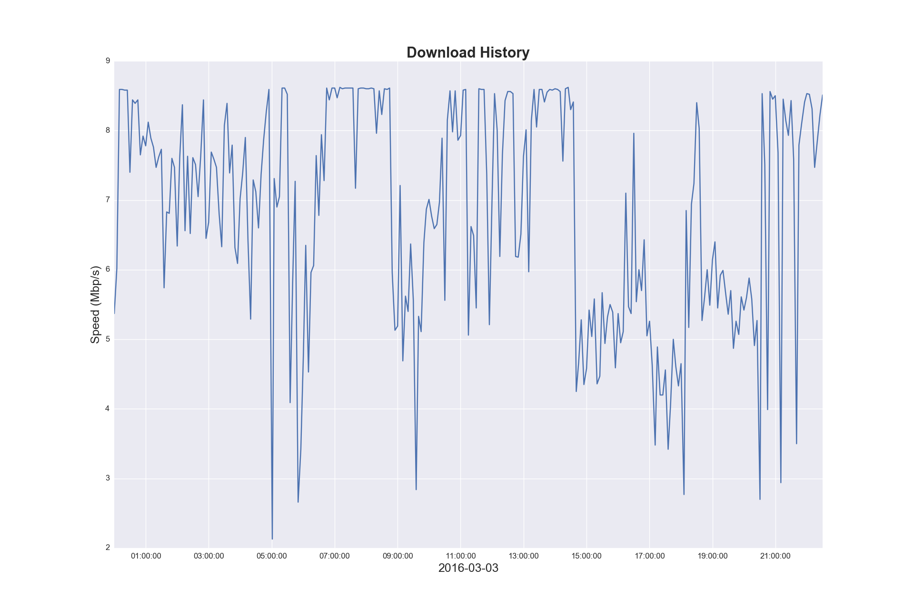
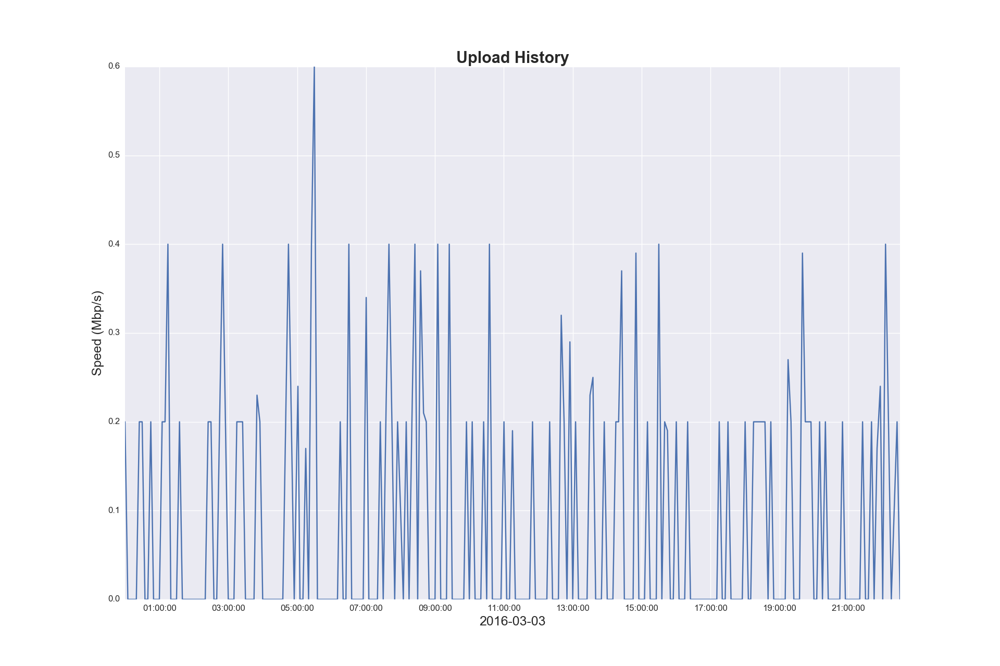
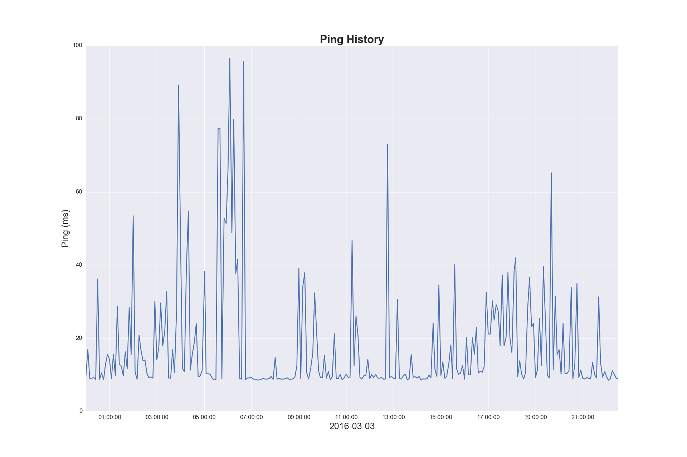

netcheck
===

Uses the speedtest-cli to check your download/upload speed and stores it in a database.
The visualize script plots the data in graphs like these:

## Getting Started
The only external package require to get netcheck.py working is speedtest-cli, the other packages are all
used by the visualize.py file to plot the data.
To generate a continuous log you need to add the netcheck.py script, either to cron on linux, or
task scheduler in windows. The example images were generated using a task scheduled to run every
5 minutes.

### Known Issues
speedtest-cli.exe generates a popup window when run from a *.pyw file.